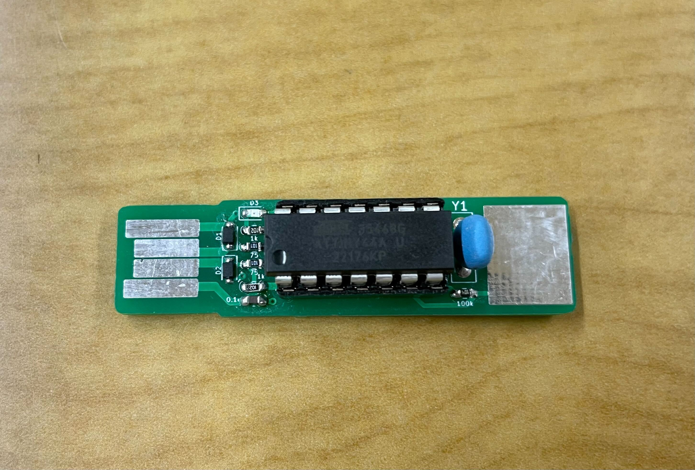
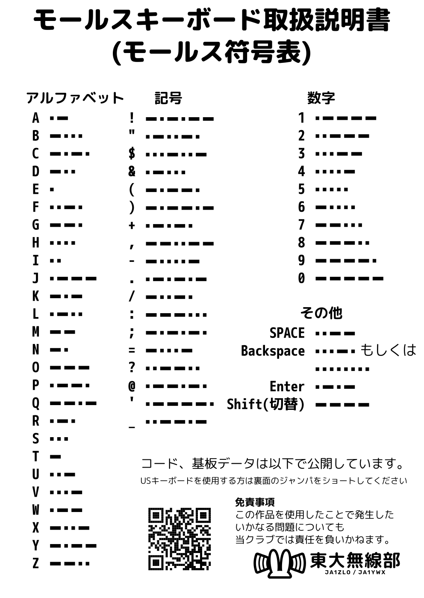

# モールスキーボード

## 使い方

モールス信号でPCに文字を入力することができる、小型のキーボードです。
お使いのPCのUSB端子に接続し、タッチパッド（銀色の部分）を使ってモールス信号を入力すると、対応するキーが入力されます。

## GitHubリポジトリについて

### board

回路図、基板レイアウトがKiCAD形式で置かれています。
KiCADはオープンソースソフトウェアであり、Windows, Mac, Linux版等が入手可能です。

### program

マイコンに書き込んだプログラムのソースコードが置かれています。

## License

The program depends on the following libraries:

- V-USB
    - https://www.obdev.at/vusb/

